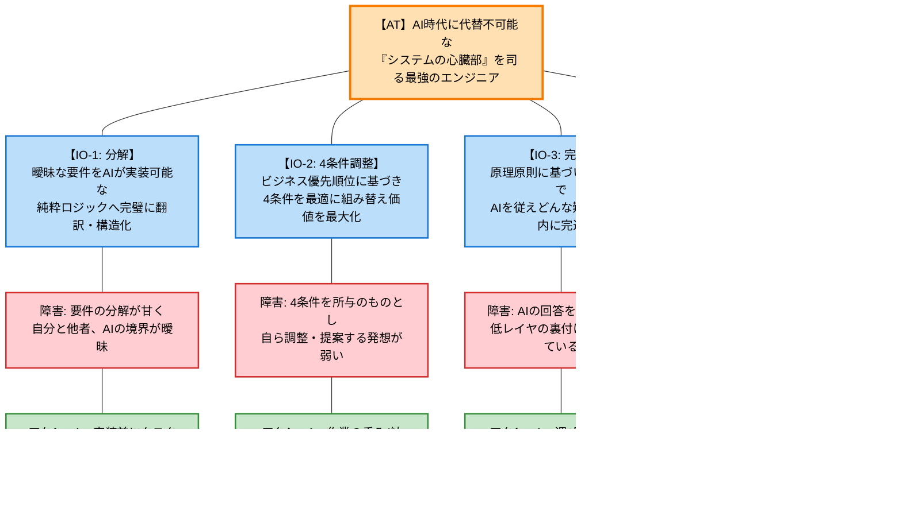

# sion908Work

現在(2026/03/03)の目標

## Ambitious Target Tree (ATT)

このツリーは「Ambitious Target Tree (ATT)」と呼ばれ、最上位の野心的な目標（Ambitious Target）を達成するために必要な中間目的（Intermediate Objectives）、直面している現状の障害（Obstacles）、そしてそれを乗り越えるための具体的な行動計画（Actions）を構造化したものです。

AI時代において「システムの心臓部を司る最強のエンジニア」となるため、自身に不足している要素を整理し、日々の業務で意識・実践すべきアクションへと落とし込んでいます。

